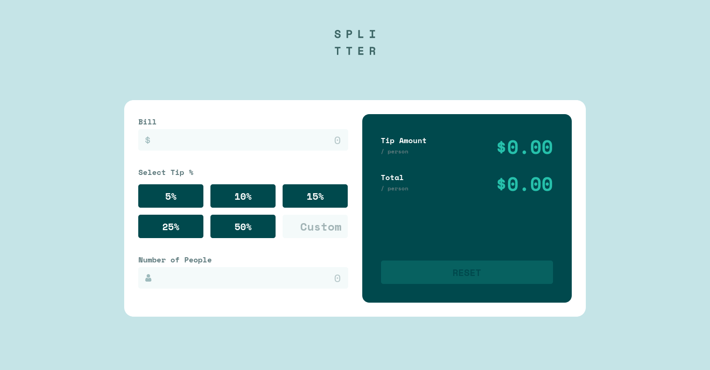

# Frontend Mentor - Tip calculator app solution

This is a solution to the [Tip calculator app challenge on Frontend Mentor](https://www.frontendmentor.io/challenges/tip-calculator-app-ugJNGbJUX). Frontend Mentor challenges help you improve your coding skills by building realistic projects.

## Table of contents

- [Overview](#overview)
  - [The challenge](#the-challenge)
  - [Starting the App](#starting-the-app)
  - [Screenshot](#screenshot)
  - [Links](#links)
- [My process](#my-process)
  - [Built with](#built-with)
  - [What I learned](#what-i-learned)
  - [Continued development](#continued-development)
- [Author](#author)

## Overview

### The challenge

Users should be able to:

- View the optimal layout for the app depending on their device's screen size
- See hover states for all interactive elements on the page
- Calculate the correct tip and total cost of the bill per person

### Starting the App

Ensure you have Node installed on your computer & git as well, then clone this repo with the command `git clone`.
Then run the following commands:-

- npm install
- npm start(Check you browser on localhost:3000)

### Screenshot

### Links

- Solution URL: [My Solution](https://www.frontendmentor.io/solutions/react-styledcomponents-grid-and-flexbox-tip-calculator-solution-uiirUrQzb)
- Live Site URL: [Live Site](https://duncan91-ops.github.io/tip-calculator-app/)

## My process

### Built with

- Semantic HTML5 markup
- CSS custom properties
- Flexbox
- CSS Grid
- Mobile-first workflow
- [React](https://reactjs.org/) - JS library
- [Styled Components](https://styled-components.com/) - For styles

### What I learned

- STYLED COMPONENTS
- REACT HOOKS
- STATE MANAGEMENT
- RESPONSIVE DESIGN
- HOSTING REACT APPS

### Continued development

- OPTIMIZATION OF REACT APP
- STYLED COMPONENTS
- EFFICIENT STATE MANAGEMENT

## Author

- Frontend Mentor - [@duncan91-ops](https://www.frontendmentor.io/profile/duncan91-ops)
